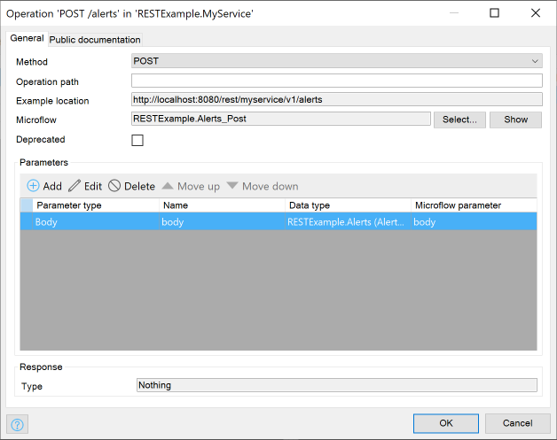
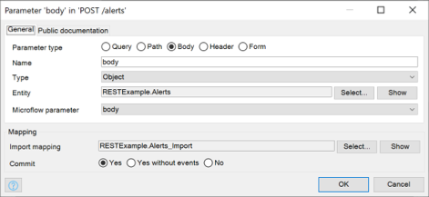

## 1 Introduction

A published REST operation is part of a [published REST resource](published-rest-resource) and defines an endpoint that a client can call to GET, PUT, POST, PATCH, or DELETE items from the resource.

This document describes the options when configuring a REST operation for your resource in the **REST Resource** window.  Under the general specifications about the Service the window is divided into two panes.  Resources for the service are listed in the **Resources** pane and for every resource it is possible to **Add** or **Edit**  operations which are listed in the **Operations** pane.  Double-click an operation or click **Edit** for the selected operation  to display the **Operation Editor**.  

## 2 General

### 2.1 Method

The **Method** displays the operation that is performed by the microflow by selecting one of the following:

* **GET** –  retrieves the entry or entries at the specified location
*  **POST** –  creates an entry in the collection at the specified location
* **PUT** – replaces the entry or entries at the specified location, or it creates them if they do not exist
* **PATCH** –  updates (part of) the entry at the specified location
* **DELETE** –  deletes the entry or entries at the specified location
* **HEAD** –  retrieves information about the entry or entries at the specified location; this is identical to **GET**, except that it does not return a message body
* **OPTIONS** – the operation returns information about the available communication options

### 2.2 Operation Path

The **Operation path** displays the location where the operation can be invoked from starting with the location of the resource and with the URL shown in  **Example location**. The **Operation path** specifies the remainder of the location URL of the operation. If left empty, then the location of the resource is used.

 [Path parameters](published-rest-path-parameters) can be used to capture part of the location as a microflow parameter or as a parameter to the import mapping. Specify the path parameters in the operation path between `{` and `}`. Whatever is in the URL at the place of the path parameter will be passed to the microflow or the import mapping.

The **Method** and **Operation path** determine the operation that gets executed for a given request URL. For further details see [Published REST routing](published-rest-routing).

### 2.3 Example Location

The URL in the **Example Location** shows the path parameters and query parameter values as placeholders between `{` and `}`.

++on the screen there ae no {}++

### 2.4 Microflow ++verify++

The **Microflow** that is used for the operation is displayed here. Click **Select**  to select or create a microflow for the operation and click **Show** to edit it.  An operation has the following parameters:

 * [**Query parameters**](published-rest-query-parameters), that are at the end of the URL in the form of `?name1=value1&name2=value2` (when a microflow parameter is not in the path and is not an object, then it is considered to be a query parameter).
 * [**Path parameters**](published-rest-path-parameters), that are part of the path of the URL.
 * A **body** parameter (optional), which is placed in the body of the request to the operation.

{} The '**GET**', '**HEAD**', and '**DELETE**' operations do not have a body parameter.

{}

 * **Header** parameters,  from the HTTP headers of the request.

 * A **form** parameter (optional), which is a part of the body of a multipart form request.

A microflow for an operation takes these operation parameters as input.

A microflow parameter that has the **List** or **Object** type indicates a body parameter. You can specify an import mapping to convert the incoming JSON or XML. 

A parameter of the **FileDocument** type (or that inherits from a **FileDocument**) can also be used for the form parameters, ++and an import mapping is not needed++.

An operation microflow may also take a [**HttpRequest**](http-request-and-response-entities#http-request) parameter. Add this parameter if you want to inspect the requested URL and headers.

To set the **status code**, **reason phrase**, and **headers**, add a [**HttpResponse**](http-request-and-response-entities#http-response) object parameter and set the attributes of that object, or return a **HttpResponse**.

The microflow determines the result of the operation with any of the following outcomes:

1. **Return a list or an object** – specify an export mapping to convert it to XML or JSON.

2.  **Return a primitive** – when the microflow returns a value, for example, a string, integer, Boolean, then the response to the operation will be that value. If a non-empty value is returned from the microflow, the **Content** attribute of the **HttpResponse** object is ignored. If an empty value is returned  then the **Content** of the **HttpResponse** is taken as the result.

3.  **Return a file document** – the microflow returns data that is a file (such as a .*PDF* or image).

4. **Return a HttpResponse** – in which the status code, reason phrase, and content (as a string) can be set. The content can be filled with, for example, the result of a mapping or a string from another source. Headers can also be added to the response. One important header to set is **Content-Type**.  

   {}An empty **HttpResponse**,  will always result in an error and should be avoided.{}

If the microflow returns an unhandled exception, the response is **500: Internal server error**.

If security is enabled, then then microflow needs to have at least one role configured to be accessible.

### 2.5 Deprecated

Check this box to mark the operation as deprecated in the service's [OpenApi (Swagger) documentation page](published-rest-services#interactive-documentation). This informs clients not to use it anymore.

### 2.6 Parameters

In this list,  **Add**, **Edit** or **Delete** the [parameters of the operation](published-rest-operation-parameter). Click **Edit** or double-click the parameter to edit the parameter settings for the selected parameter in the **Parameter** Editor window.

### 2.6.1 Import Mapping {#import-mapping}

For a parameter of **Type** **Body**, an [import mapping](import-mappings) that converts the body of the request to an object can be selected by . 

{}

All object and list parameters, except for file documents, must have an import mapping specified. 

{}

For the selected import mapping, it is also possible to select the commit behavior of the mapping: **Yes** , **Yes without events**, or **No** to not commit imported objects.

{}

An import mapping that takes no parameters can also be specified, or one that takes a primitive parameter (for example, string, integer). If you select an import mapping with a primitive parameter, there must be exactly one [path parameter](published-rest-path-parameters) with the same type that will be passed to the import mapping.

{}

You can indicate what should happen **If no object was found** when the import mapping has checked the box **Decide this at the place where the mapping gets used**.

++to be verified where this is done and what is shown on screen++

If you select an import mapping that supports both XML and JSON (for example, a mapping that is based on a message definition), then the operation will be able to handle both XML and JSON requests.

{}
Valid requests must  contain a **Content-Type** header. See [Table 1: Recognized media types](#table1) below for a list of media types that are understood by the import mapping. If an unsupported content type is used, the operation will result in a "400 Bad Request" response.

{}

The import mapping is also used to generate object schemas for operation responses in [OpenAPI (Swagger) documentation page](published-rest-services#interactive-documentation) based on [JSON Schema](published-rest-service-json-schema).

### 2.7 Response

For the **Response**  specify the **Type** of the microflow result and  **Export mapping** applied to it (if any).

++only Type field present here and no field for specified the Export mapping - where is this now?**

#### 2.7.1 Type

The **Type** field displays the result type of the microflow.

#### 2.7.2 Export Mapping

When the microflow returns an object or a list of objects, you need to specify how the result is mapped to JSON or XML. Select an export mapping that takes the result of the microflow as input.

If you **Select** an export mapping that supports both XML and JSON (for example, a mapping that is based on a message definition), then the output depends on whether the microflow has a parameter of type **System.HttpResponse** and adds a **Content-Type** header to it. The following scenarios are possible:

* When the microflow sets the **Content-Type** header with a media type that is XML (see [Table 1: Recognized media types](#table1)), then the operation returns XML
* When the microflow sets the **Content-Type** header to something else, then the operation returns JSON
* When the microflow does not set the **Content-Type** header, then the output is determined by inspecting the **Accept** header in the request. The first media type that is understood to be XML or JSON (see [Table 1: Recognized media types](#table1)) determines the operation result, and the **Content-Type** is **application-xml** (for XML format) or **application-json** (for JSON format)
* When there is no **Accept** header or the **Accept** header does not contain a recognizable media type, then the operation returns JSON and the **Content-Type** is **application/json**

| Media Type                   | Recogized As |
| ---                          | --- |
| `application/xml`            | XML |
| `text/xml`                   | XML |
| anything ending with `+xml`  | XML |
| `application/json`           | JSON |
| anything ending with `+json` | JSON |

**Table 1: Recognized media types**

The export mapping is also used to generate object schemas for operation responses in the [OpenAPI (Swagger) documentation page](published-rest-services#interactive-documentation) based on the [JSON schema](published-rest-service-json-schema).

## 3 Public Documentation

In the **REST Resource** window specify the public documentation that is used in the service's [OpenAPI (Swagger) documentation page](published-rest-services#interactive-documentation).

++but when  **Edit** the dialog box displays **Location** for the prompt - verify if this should actually say file name and location++

### 3.1 Summary

The summary provides a short description of what the operation does.

### 3.2 Description

The description provides a complete overview of what the operation does. You can use [GitHub-flavored markdown](gfm-syntax) for rich text.

## 4 Example

**How to publish REST natively with Mendix**

{}
